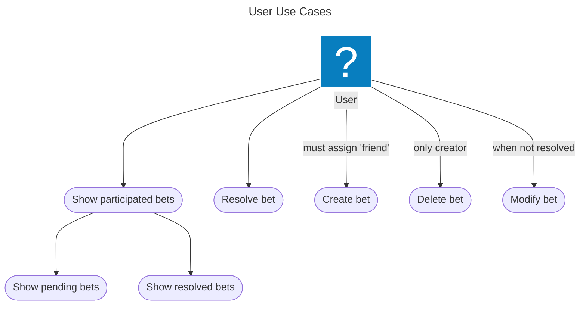

```mermaid
---
title: User Use Cases
---
flowchart TB
    USER(["User"]) ---> BET_VIEW(["Show participated bets"]) & BET_RESOLVE(["Resolve bet"])
    BET_VIEW ---> BET_VIEW_PENDING(["Show pending bets"]) & BET_VIEW_RESOLVED(["Show resolved bets"])
    USER -- must assign 'friend' ---> BET_CREATE(["Create bet"])
    USER -- only creator ---> BET_DELETE(["Delete bet"])
    USER -- when not resolved ---> BET_UPDATE(["Modify bet"])

    USER@{ icon: "fa:user", pos: "b", h: 80}
```