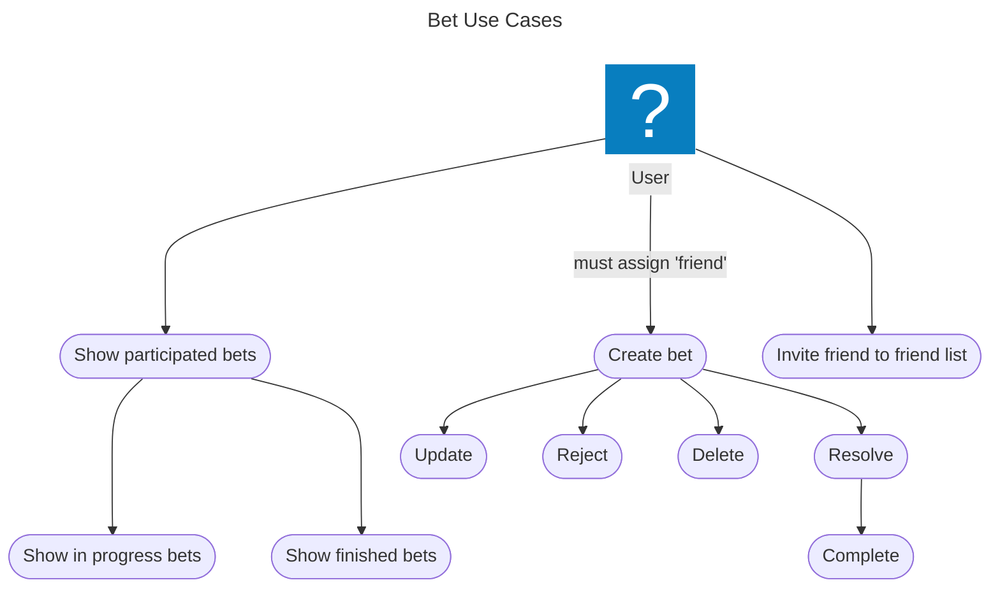

# Bet Keeper project

Bet Keeper is an IT solution designed to manage bet among group of friends or anyone who enjoys making light-hearted bets and competitions with ther circle. This platform simplify the process of recording, tracking and resolving bets ensuring that all participants stays up-to date with their ventures.

Main objective is to easily create and store bets with details such as participants, terms, stakes and deadlines. There must be a bet resolution mechanism where user can resolve bet (optionaly upload evidence to support their claims). Platform should have possibility to invite friends to participate in challenges.

Additionally users should be reminded about upcoming bet deadlines or be notified when bet is resolved. 

Ensuring transparancy that reduce confusion and enhance accountability casual bets are transformed to enjoyable experience where friends can focus on fun without worriyng about logistics. 

In the future from collected data platfrom will be able to show statistics related to bets such as number of bets won, lost or participated. When platform will have more users there is a possiblity to create a leaderboards to track the most active bet-makers and provide additional gamification mechanism such as levels, badges or avatars to personalize your profile.

# Planning

## Requirements

Bussines requirements - without this functionalites application will not achieve the project goal. 
Functional requirements - additional application functionalities support core processes.  
Usability requirements - requirements related with use envionment and expected use cases.

1. (Bussines) Provide a platform to manage bets between friends to reduce the issue with remebering the terms and stakes.
1. (Functional) User should be able to create bet  
    Bet must contains details such as
    - participants
    - terms
    - stakes
    - deadlines to complete stake (optional)
2. (Functional) User should be able to see bets that he participate (including resolved, completed etc.).
3. (Functional) Bet participant should be able to resolve bet (who won).
4. (Functional) Bet participant should be able to mark bet as completed.
6. (Functional) Bet participant should be able to reject bet
6. (Functional) Administrator should be able to invite new user via email to application.
6. (Functional) Creator should be able to delete bet.
6. (Functional) Administrator should be able to delete any bet.
4. (Functional) User should be notified when bet is Finished.
5. (Functional) User should be notified when bet deadline is approaching (if bet is not Finished) (3 days left).

7. (Functional) During bet creation creator should be able to select one friend from his friend list to be participate of the bet. 
8. (Functional) Bet list should have ability to filter bets by:
    - status field
    - participatns
    - creation date
8. (Functional) Bet list should have ability to sort bets by:
    - status field
    - creation date
    - deadline date
8. (Functional) User should be able to add another user to his friend list by username (email is a username).
9. (Functional) User should be able create new user invitation request to administrator.
10. (Functional) Administrator should be able to approve invitation of new user.
8. (Functional) There should be an audit event logs for each bet and it should contains details related with state changes, who, when and what did in this change. 

11. (Usability) Application should be mobile-friendly.
11. (Usability) Application data should be in sync with other users.
12. (Usability) In a few clicks (max 3) user should be able to create a new bet.
13. (Usability) In a few clicks (max 3) user should be able to see the list of bets he need to complete.
5. (Usability) Notification should be send as Push.

## Use cases

When bet is "resolved" then it must be done by looser. When stake is done it is "completed". 

Finished is a state for bets that are Completed or Rejected.

