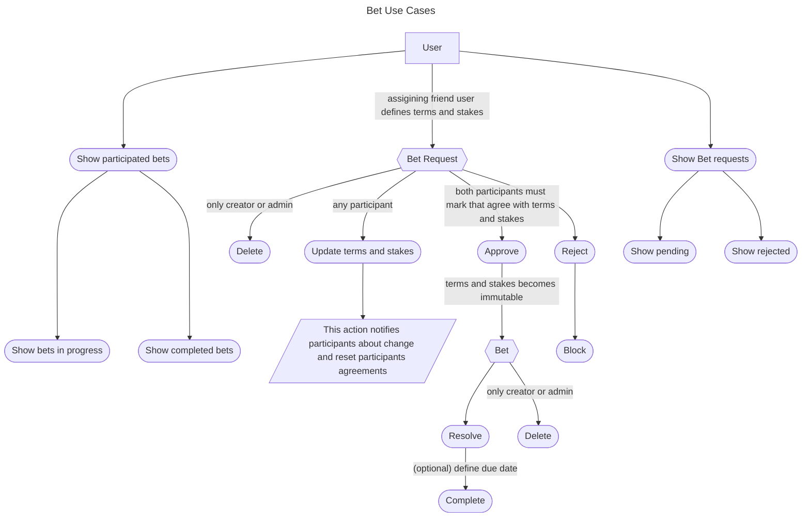
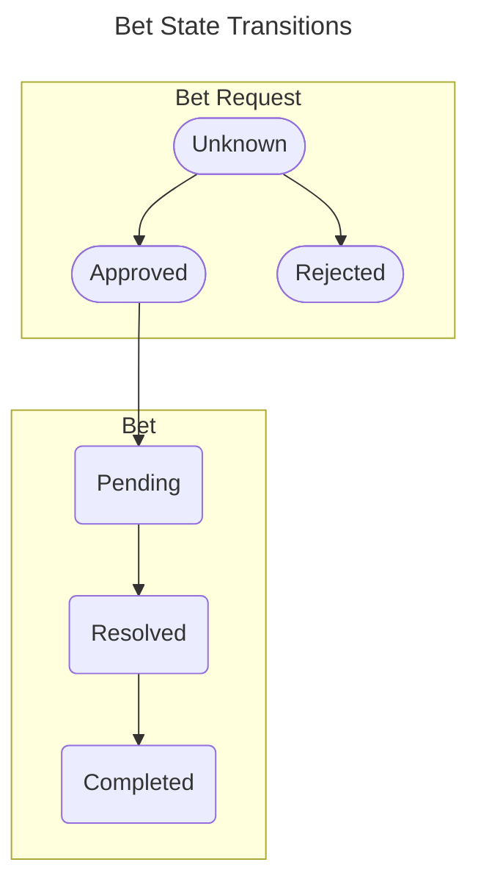

### Bet context
User with at least one friend he is able to create new bet request. **Bet request** is a draft of **Bet** where participants must define common version of terms and stakes that are accepted by both participants. Any participant can approve or reject given terms and stakes. When participant reject request it disappears from his pending bet request list but still is able to find it from bet requests rejected list view.

Each update of terms and stakes within bet request reset the participants votes. It is not approved nor rejected - its just in pending state. Each participants must again decide if they are rejecting or approving bet terms and stakes. If someone will change the content of bet it might cause the notification flood or other unwanted items on users dashboard so there is a possibility to block given bet request and given bet will not appear in pending list and user will not receive notifications.
CREATOR should be able to delete given bet request and this removes this item from system completly and forever.

When both participants approved terms and stakes Bet Request produces a Bet instance that has immutable terms and stakes. When bet is created any participant can resolve bet which means that person who lose must realize the "stake". When it will be done bet participant should mark bet as completed. Completed bets should not be visible on user bets in progress list. In participated bets completed bets should be moved to separate view.

Bet Request participant statuses:
For each participant of bet request there should be a current state of his "Vote". When last participant approve stakes given bet request is transformed into bet.

### Stake idea context
User should have possibility to create a stake idea for given bet that will be stored in notebook. This list should be visible only for given user. User should be able to browse this list and delete or modify stake idea.

In future this idea might be shown during defining a new bet as suggestion for stake.

[Next use case](./friend_context.md)