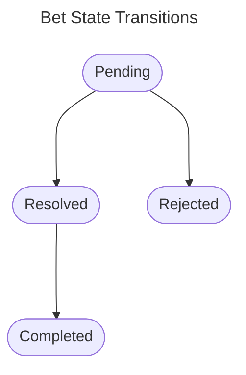

### Bet context
Then when User have at least one friend he is able to create new bet. When bet is created he must be able to modify the bet content. As CREATOR he should be able to delete given bet. Any BET PARTICIPANT should be able to reject or resolve given bet. Resolve means that person who lose must realize the "stake". When it will be done bet participant should mark bet as completed. Completed and Rejected bets should not be visible on user bets in progress list. Both are treated as FINISHED so there is no more further actions possible. Those items should be move to separate view that presents only Finished bets.

Bet statuses:

### Stake idea context
User should have possibility to create a stake idea for given bet that will be stored in notebook. This list should be visible only for given user. User should be able to browse this list and delete or modify stake idea.

In future this idea might be shown during defining a new bet as suggestion for stake.

[Next use case](./friend_context.md)