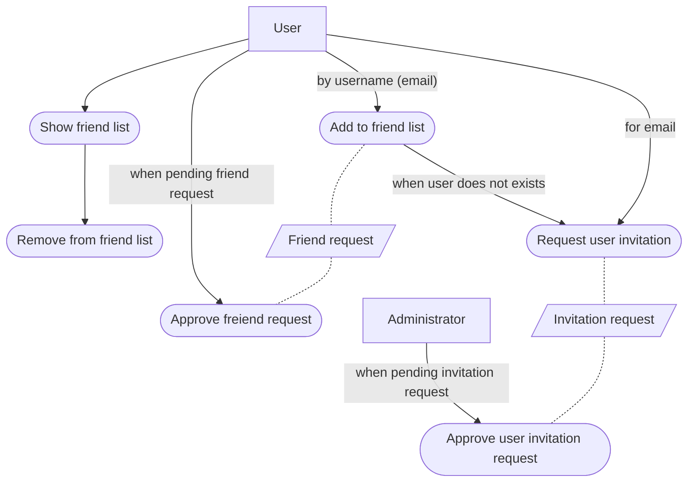

### Friend context

As USER before I will be able to create new request Bet I must have at least one friend in my "friend list". I should be able to see my friend list and add a new person by email. If that person is not a user of this application I should see the possibility to request access for this person that will be send to application ADMINISTRATOR. When administrator approve this request a new account will be created and new user will receive a note that he has been invite to use BetKeeper with pending friend request.

There should be a possibility to remove users from bet list to not receive bet request from unwanted person.

[Previous use case](./bet_context.md)
