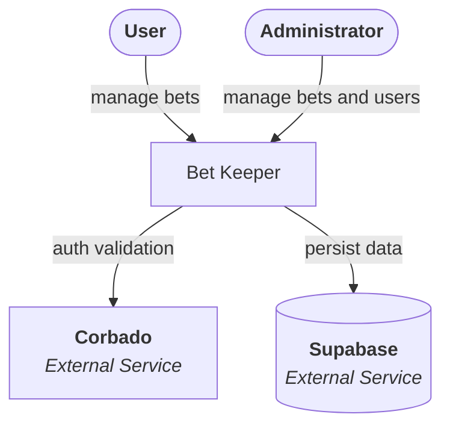

### Context Architecture
From bird's-eye view the application architecture is very simple. Actors such as user and admin are using Bet Keeper application to perform use cases actions. Application connects to external systems to provide user authentication and persis user data.

[More details](./02-containers.md)