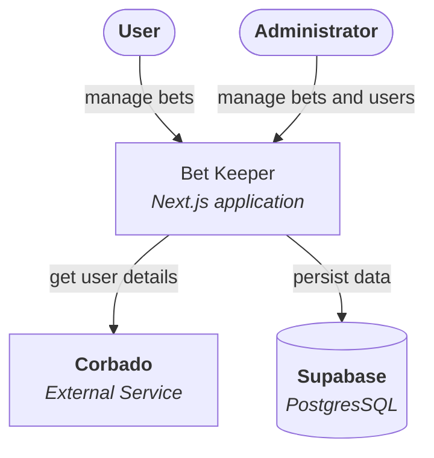

### Containers Architecture
Container level of details of the application architecture is the same as it was explained in context level. In this level we add additional context of chosen frameworks and tech solutions.

[Less details](./01-context.md) | [More details](./03-components.md)