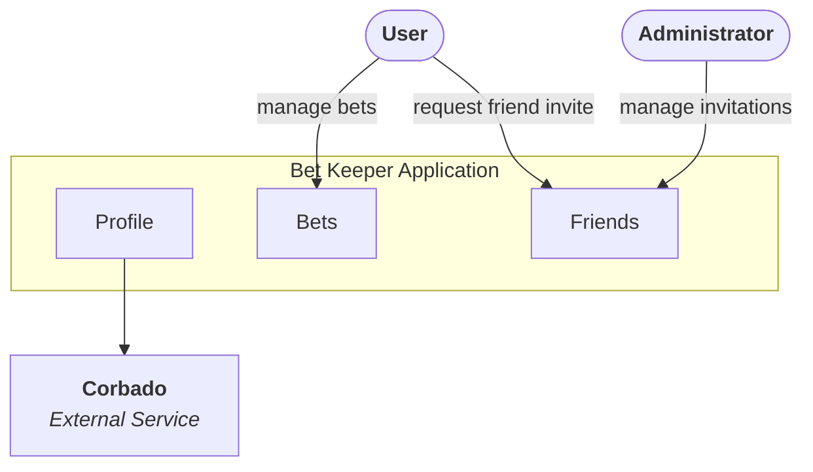

### Components Architecture

Components architecture based on the requirements and defined use cases can be divided into three sections:
- Bets
- Profile
- Friends

Bets component will provide all things related with bet management. It will require dependency to user friends list but it will be mostly independend slice of application.

Friends module is dependend on the Authorization service that will provide external user Id that will bind user data with friend context. 

Profile is focused on the user data such as first and last name and login methods.

[Less details](./02-containers.md)