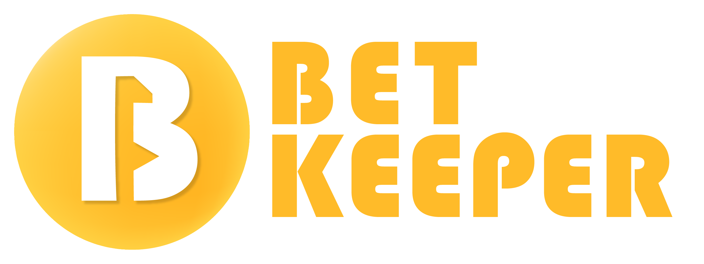

# [Bet Keeper](https://radek2s.github.io/BetKeeper/)



[](https://biomejs.dev/)

[](https://codecov.io/gh/radek2s/BetKeeper)

# 🏗️ Project under construction...

New version of this application is under construction. Project will be planned, designed
and documented according to best known by me design practices such as stages are
requirement gathering, taking architectural decisions, performing UI wireframe, performing
UX design and testing and finally development of the application.

## Project documentation

All related documents are stored in "doc" directory within this project. Git is used to
versionning of the files and keeping the audit logs with established decisions.

[Requirements](./documents/01_requirements/00-requirements.md)


## Tech stack:

- [NX](https://nx.dev/) - Build platform to manage codebase and organizae modules within
  BetKeeper monorepo.
- [Vite](https://vite.dev/) - Build Tool.
- [Next.js](https://nextjs.org/) - React Framework for full stack expirience for
  web-application.

- [Biome.js](https://biomejs.dev/) Performant toolchain for WebApplication

### Sub modules

- [Domain](./domain/readme.md)
- [Application](./application/readme.md)
- [E2E Tests](./e2e-tests/readme.md)

## Development Quick Start

Installation
```
npm i
```

This project is running with NX tool that provide additional project graph where developer
can check the dependencies betweeen modules.

```
nx graph
```

There are projects within this monorepo:

- domain - bussiness logic and tests of core BetKeeper objects
- application - application layer that host an UI and wrap bussiness logic with database
  persistance and server logic
- e2e-tests - end-to-end tests for BetKeeper application that check if requirements are met using cucumber and playwright.


### License

Images from [unDraw](https://undraw.co/)  
Icons from [fluentIcons](https://fluenticons.co/)
