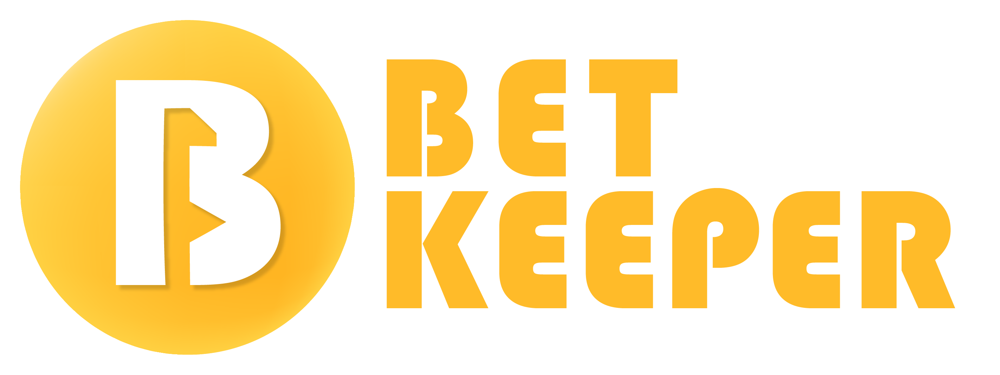

# [Bet Keeper](https://radek2s.github.io/BetKeeper/)



[](https://biomejs.dev/)

# 🏗️ Project under construction...

New version of this application is under construction. Project will be planned, designed
and documented according to best known by me design practices such as stages are
requirement gathering, taking architectural decisions, performing UI wireframe, performing
UX design and testing and finally development of the application.

## Project documentation

All related documents are stored in "doc" directory within this project. Git is used to
versionning of the files and keeping the audit logs with established decisions.

[Requirements](./documents/01_requirements/00-requirements.md)


## Tech stack:

- [NX](https://nx.dev/) - Build platform to manage codebase and organizae modules within
  BetKeeper monorepo.
- [Vite](https://vite.dev/) - Build Tool.
- [Next.js](https://nextjs.org/) - React Framework for full stack expirience for
  web-application.

- [Biome.js](https://biomejs.dev/) Performant toolchain for WebApplication

### Sub modules

- [Domain](./domain/readme.md)
- [Application](./application/readme.md)

## Development Quick Start

Installation

```
npm i
```

This project is running with NX tool that provide additional project graph where developer
can check the dependencies betweeen modules.

```
nx graph
```

There are two projects within this monorepo:

- domain - bussiness logic and tests of core BetKeeper objects
- application - application layer that host an UI and wrap bussiness logic with database
  persistance and server logic

## Usefull commands

Run application and perform E2E tests in Playwright UI
```shell
npx nx run application:serve
npx nx run e2e-tests:e2e --ui
```

Run E2E tests in headless mode
```shell
npm run e2e
```

Run E2E tests in headed mode (with browser UI)
```shell
npm run e2e:headed
```

Run Cucumber Behaviour-Driven Development tests that verifies requirements
```shell
npx nx run bet-keeper:test:bdd
```
Then you can open [cucumber-report.html](./test-result/cucumber-report.html) to visit what requriements are met.


### Local environment

- Clone repository
  ```
  git clone https://github.com/radek2s/BetKeeper.git
  ```
- Install dependencies for frontend application
  ```
  npm i
  ```
- Run application (from root directory)
  ```
  npm run start
  ```
- Open browser on address [http://localhost:5173/](http://localhost:5173/)

### Firebase environment

To connect with firebase to store your bet data just create a new Firebase Application and
provide all required configuration data directly on "Settings" page.

## Development

Application was designed in Adobe XD. Then based on prepared mocup this application has
been created.

### Scripts

- `npm install`: install project dependencies
- `npm prepare`: install husky 🐶 - pre-commit hooks
- `npm start`: Starts the application
- `npm test`: Run Unit Tests
- `npm run build`: Builds the application for production

### PWA

To check the PWA application you must deploy that application on any HTTP server. For
localhost you don't need to wory about SSL certificates. But for any other external server
the SSL certificate must be valid and trusted and otherwise the application service worker
will not start and the application will not work as PWA.

### License

Images from [unDraw](https://undraw.co/)  
Icons from [fluentIcons](https://fluenticons.co/)
