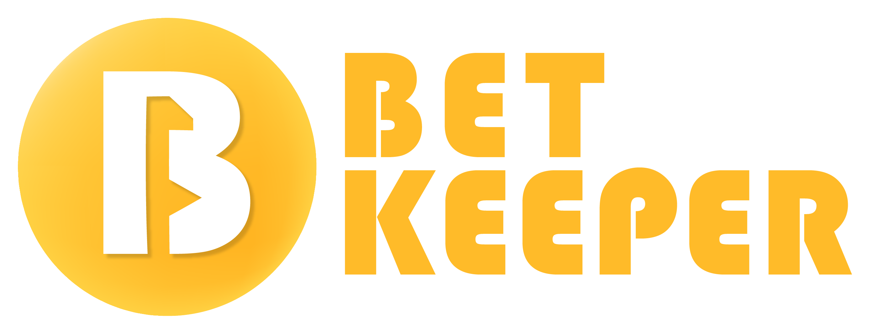

# [Bet Keeper](https://bet-keeper.vercel.app)




[](https://biomejs.dev/)

[](https://codecov.io/gh/radek2s/BetKeeper)

# 🏗️ Project under construction...

Project enters final phase before release of version 3.0 according to [BetKeeper plan](https://github.com/users/radek2s/projects/1). Now application is validated against usability tests in small group of people. 

# About

Bet Keeper is an IT solution designed to manage bet among group of friends or anyone who enjoys making light-hearted bets and competitions with ther circle. This platform simplify the process of recording, tracking and resolving bets ensuring that all participants stays up-to date with their ventures.  
[read more...](./documents/01_requirements/00-requirements.md)

## Development plan

The main goal of this project is to show my experience in designing and developing web applications. **The project will follow the full software development lifecycle**, starting from design, then moving through implementation, verification, and validation. Each phase will be completed in a waterfall model. During the validation phase, I will collect feedback that will help improve the application in the next version.

#### Design Phase
In this phase, I will define the requirements and prepare sketches and interface designs. This will help set the scope of the work and the expected result.

- [Requirements](./documents/01_requirements/00-requirements.md)
- [Bet Use Cases](./documents/01_requirements/use_cases/bet_context.md)
- [Friend Use Cases](./documents/01_requirements/use_cases/friend_context.md)
- [Architecture Design](./documents/03_architecture/01-context.md)
- [Concept graphics | Wireframes](./documents/04_concept_designs/readme.md)
- [Mockups more detailed desing](./documents/05_app_designs/readme.md)

#### Implementation Phase
During implementation, I will build each module of the application using good software development practices. The code will be clean, maintainable, and easy to extend.

- [Project plan](https://github.com/users/radek2s/projects/1)

#### Verification Phase
All parts of the application will be verified using unit tests and end‑to‑end tests. This will ensure that the system works correctly and meets the defined requirements. 

- [Tests reports](https://github.com/radek2s/BetKeeper/actions/workflows/dev-branch-health.yml)

#### Validation Phase
The ready release candidate version  will be shared with a small test group. Their feedback will help evaluate the usability of the application and guide improvements for the next release.

... Current phase ...


# Technology

- [NX](https://nx.dev/) - Build platform to manage codebase and organizae modules within
  BetKeeper monorepo.
- [Vite](https://vite.dev/) - Build Tool.
- [Next.js](https://nextjs.org/) - React Framework for full stack expirience for
  web-application.

- [Biome.js](https://biomejs.dev/) Performant toolchain for WebApplication

### Sub modules

- [Domain](./domain/readme.md)
- [Application](./application/readme.md)
- [E2E Tests](./e2e-tests/readme.md)

# Development Quick Start

Installation
```
npm i
```

This project is running with NX tool that provide additional project graph where developer
can check the dependencies betweeen modules.

```
npx nx graph
```

There are projects within this monorepo:

- domain - bussiness logic and tests of core BetKeeper objects
- application - application layer that host an UI and wrap bussiness logic with database
  persistance and server logic
- e2e-tests - end-to-end tests for BetKeeper application that check if requirements are met using cucumber and playwright.

There are two modes to run application:
- Manual Authentication (via manual set of active user ID)
- [Corbado Authentication](https://www.corbado.com/) requires creation of free open-source project and providing valid properties to `.env` variable

**Starting BetKeeper in development mode**
```shell
npm run dev:init # To initialize SQLite database (can be ommited when already created)
npm run dev
```


# License

Images from [unDraw](https://undraw.co/)  
Icons from [fluentIcons](https://fluenticons.co/)


[Using RadixUI Primitives](https://www.radix-ui.com/primitives)
